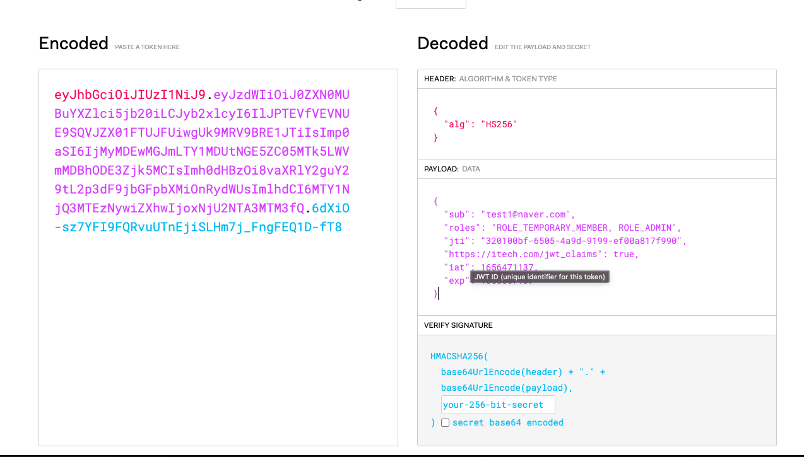

## Docker Image

### Network
> docker network create --driver=bridge --gateway 172.19.0.1 --subnet 172.19.0.0/16 guide-network
### REDIS
> docker run -d --network guide-network --name redis -p 6379:6379 lgodl1598/redis:1.0
### DATABASE
> docker run -d --network guide-network -p 5432:5432 --name postgres lgodl1598/postgres:1.0


# 도메인 작성 규칙

1. 객체생성은 Builder 패턴과 static 생성자만 허용한다.
2. 기본생성자는 Protected 접근지시자를 사용한다.
3. 도메인에서 @Data 는 사용하지 않는다.
4. @ToString 은 무한 참조가 생길 수 있으므로 of 를 사용하여 필요한 필드만 사용한다.
5. 테이블의 이름은 반드시 명시한다.
6. 클래스 상단에 @Builder X 생성자 상단에 @Builder O
7. 컬럼의 이름도 반드시 지정하여 사용한다.
8. 도메인 주도 설계(DDD) 객체 자신이 포함하고 있는 데이터를 조작하는데 필요한 행동을 정의한다.
9. 무책임한 @Setter 사용은 금지한다.
10. JPA @Embedded 를 활용하여 도매인 객체의 책임을 나누어 사용한다.
11. 줄임말을 지양하고 정확한 이름을 사용한다. ex) msg x / message o

# URI 명명 규칙

1. URI는 정보의 자원을 표현해야한다.
2. 자원에 대한 행위는 HTTP METHOD(GET, POST, PUT, DELETE)로 표기한다.
3. 슬래시 구분자는(/) 계층관계를 나타내는데 사용한다.
4. URI 마지막 문자로 슬래시(/)를 포함하지 않는다.
5. 하이픈(-)은 URI 가독성을 높이는데 사용한다.
6. 밑줄(_)은 URI에 사용하지 않는다.
7. URI 경로에는 소문자가 적합하다.
8. 파일 확장자는 URI에 포함시키지 않는다.


# static 생성자 명명 규칙
> 생성자는 private가 원칙이다.
1. from : 매개변수 하나를 받아서 해당 타입의 인스턴스를 반환하는 형변환 메서드 \
ex) Date date = Date.from(instant);
2. of : 여러개의 매개 변수를 받아서 객체를 생성
3. getInstance | instance : 인스턴스를 생성. 이전에 반환했던 것과 같을 수 있음.
4. newInstance | create : 새로운 인스턴스를 생성
5. get[OtherType] : 다른 타입의 인스턴스를 생성. 이전에 반환했던 것과 같을 수 있음.
6. new[OtherType] : 다른 타입의 새로운 인스턴스를 생성.
## dependencies
- -----
### [io.jsonwebtoken](https://jwt.io/)
### [spring-boot-starter-data-jpa](https://spring.io/guides/gs/accessing-data-jpa/)
### [spring-boot-starter-validation](https://spring.io/guides/gs/validating-form-input/)
### [spring-boot-starter-web](https://spring.io/guides/gs/spring-boot/)
### [springdoc:springdoc-openapi-ui:1.6.9](https://springdoc.org/)
### [org.projectlombok:lombok](https://projectlombok.org/)
### [boot:spring-boot-starter-test](https://memostack.tistory.com/197)
### [org.springframework.boot:spring-boot-starter-security:2.7.0](https://spring.io/guides/gs/securing-web/)


## 응답 규칙


```ecma script level 4
{
    "success": true,
    "code": 0,
    "msg": "성공하였습니다.",
    "date": {
        "id": 38,
        "email": "test1@naver.com",
        "name": "test",
        "age": 0
    }
}
```

## JWT 구조




